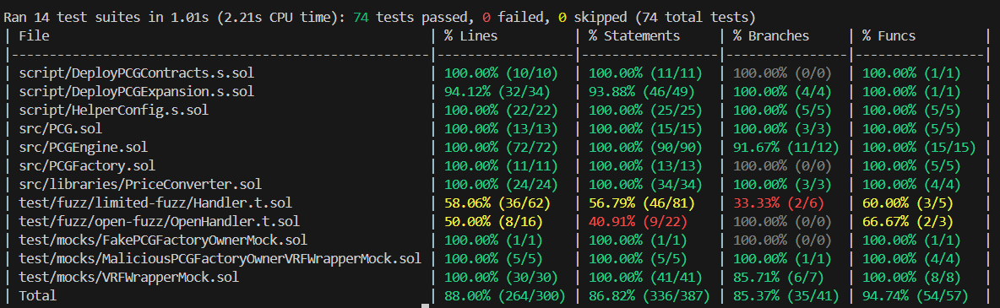

# Printable Card Game Powered by Blockchain and AR Technologies

## Table of Contents
- [Printable Card Game Powered by Blockchain and AR Technologies](#printable-card-game-powered-by-blockchain-and-ar-technologies)
  - [Table of Contents](#table-of-contents)
  - [Description](#description)
    - [Introduction](#introduction)
    - [Motivation](#motivation)
    - [Main Consept](#main-consept)
    - [PCG Components](#pcg-components)
    - [Blockchain Back-end Features](#blockchain-back-end-features)
    - [Blockchain Back-end Components](#blockchain-back-end-components)
  - [Getting Started](#getting-started)
    - [Requirements](#requirements)
    - [Quickstart](#quickstart)
  - [Usage](#usage)
    - [Setup](#setup)
    - [Test](#test)
    - [Deploy PCG Factory and PCG Engine on a local Blockchain](#deploy-pcg-factory-and-pcg-engine-on-a-local-blockchain)
    - [Interact with PCG Factory and PCG Engine on a local Blockchain](#interact-with-pcg-factory-and-pcg-engine-on-a-local-blockchain)
    - [Deploy a PCG Expansion on a local Blockchain](#deploy-a-pcg-expansion-on-a-local-blockchain)
    - [Interact with a PCG Expansion on a local Blockchain](#interact-with-a-pcg-expansion-on-a-local-blockchain)
    - [Example of purchasing PCG Tokens and receiving the funds as the Owner of the Contracts](#example-of-purchasing-pcg-tokens-and-receiving-the-funds-as-the-owner-of-the-contracts)
    - [Setup for deployment on a test Network](#setup-for-deployment-on-a-test-network)
    - [Test on a test Network](#test-on-a-test-network)
    - [Deploy PCG Factory and PCG Engine and Interact with them on a test Blockchain](#deploy-pcg-factory-and-pcg-engine-and-interact-with-them-on-a-test-blockchain)
    - [Deploy a PCG Expansion and Interact with it in a test Network](#deploy-a-pcg-expansion-and-interact-with-it-in-a-test-network)
    - [Example of purchasing PCG Tokens on a test Network](#example-of-purchasing-pcg-tokens-on-a-test-network)
  - [Tutorials and Resources](#tutorials-and-resources)

## Description

### Introduction
The "Printable Card Game" (PCG) is a proof-of-consept game that combines the traditional elements of physical card games with the modern technologies of Blockchain and Augmented Reality. It serves as a proof of how the value of a physical asset can exist in a decentralized digital environment in the use case of gaming. 

### Motivation
This project will be used as a case study for my PhD with focus on "Blockchain enhancing gaming industry". It also serves as a way to prove my technical skills in blockchain technology.

### Main Consept
The consept of PCG is that cards are represented in a decentralized digital environment as [ERC-1155 tokens](https://ethereum.org/el/developers/docs/standards/tokens/erc-1155/) that users can acquire them by purchasing them, print them and play with them by scanning them through the "PCG AR Mobile Application".
They can also trade or sell them due to the nature of the ERC-1155 tokens. Normally, in a physical card game remote trades and sells can happen via at least one trusted third party service that manages transportation. When players trade a PCG card they just have to change the owner of the token that represents the card instead of sending the physical copy because the new owner of the token can just print the card for themselfs. While the printing of a card is possible whether or not a player is the owner of the corresponding token, to use the card from the "PCG AR Mobile Application", they have to own the token in their blockchain account.   

### PCG Components
- **Marketplace Front-end**: This is the area where the users will be able to purchase PCG Cards.
- **AR Mobile Application**: This app will be used to scan the PCG Cards and create effects.
- **Blockchain Back-end**: This is the logic behind purchases and token ownership.
- **IPFS**: The token information and images(metadata) are not stored on the blockchain but in a decentralized storage called [IPFS](https://ipfs.tech/). </br>
This codebase is specifically for the Blockchain Back-end Component and IPFS.

### Blockchain Back-end Features
- **ERC-1155 Tokens from Openzeppelin**: This project utilizes [Openzeppelin](https://www.openzeppelin.com/contracts)'s ERC-1155 token contract for the creation, ownership and general management of the PCG cards. ERC-1155 tokens serve as value for the physical cards.
- **Verifible Randomness with Chainlink VRF V2.5**: Players are be able to acquire tokens from a pool of tokens at random. This is possible through the use of [Chainlink's Verifible Randomness Function](https://docs.chain.link/vrf). 
- **Direct Funding of Randomness**: This project implements the Direct Funding [model of payment to Chainlink's VRF](https://docs.chain.link/vrf/v2-5/billing) instead of the subscription model. This means that the payment of the VRF happens at the purchasing of the tokens and the payment happens in the native currency of the blockchain used (e.g. in Ethereum it is Ether). Native payment is supported in chainlink's VRF V2.5. It cannot be used in older versions.  
- **Native to Euro Payments with Chainlink Price Feeds**: Other than the VRF's cost, the tokens also have a flat cost in euro (2 euro). To calculate the cost in the native currency [Chainlink's Price Feeds](https://docs.chain.link/data-feeds) are being utilized and specifically the Native currency to USD price feed and Euro to USD price feed. This is because there is no straight Native currency to Euro price feed.

### Blockchain Back-end Components
The components of the projects refer to the smart contracts that have been developed for it.
- **PCG**: This contract is the ERC-1155 implementation of the project. Multiple PCG contracts can be deployed for the game. Each deployment of a PCG contract is considered an expansion of the game. 
- **PCG Factory**: This contract manages the PCG expansions. It provides the functionality of of the deployment of PCG expansions and it handles the storing of the expansions.
- **PCG Engine**: This contract manages the purchasing and pricing of PCG tokens. It utilizes chainlink's VRF V2.5 for randomness of the token purchasing(like opening a pack of a physical card game) and Price Feeds to calculate the costs of the tokens and VRF. Users can purchase 1-3 tokens a a time.

## Getting Started

### Requirements
- [git](https://git-scm.com/book/en/v2/Getting-Started-Installing-Git)
  - Check if it was successful by running `git --version` and get a response like `git version x.x.x`
- [foundry](https://getfoundry.sh/)
  - Check if it was successful by running `forge --version` and get a response like `forge 0.2.0 (816e00b 2023-03-16T00:05:26.396218Z)`
- [make](https://www.gnu.org/software/make/manual/make.html#Introduction)
  - Check if it was successful by running `make --version` and get a response like `GNU Make 4.3`

### Quickstart
1. Run this in the project's root directory.
```bash
git clone https://github.com/John-Christidis/printable-card-game
```
2. Navigate to the project's folder
```bash
cd printable-card-game
```
3. Install the dependences
```bash
make install-deps
```
4. Build the project's smart contracts
```bash
make build
```

## Usage
This is a very minimal workflow of how the contracts work and what follows bellow.
1. Deploy PCG Factory and PCG Engine
2. Deploy PCG Expansions by PCG Factory
3. Purchase tokens from a PCG Expansion by PCG Engine
4. Wait for VRF to provide randomness and tokens will be recieved
5. Recieve the funds as the owner of the contracts

### Setup
 1. Create a `.env` file similar to the `.env.example`. The variables will be filled later.
The reason the variables are stored in the `.env` in such a way is because they are used by the `Makefile` of the project. 
 2. In the terminal type `source .env` to allow the variables in the `.env` file to be used in the terminal.
 3. Open up a new terminal and type `anvil` to start a new local blockchain node with some available accounts. Each account has an address, a private key and some ETH.
 4. Find the first account, copy its address and paste it to the `.env` file as the value of `ANVIL_DEPLOYER_ADDRESS`.
 5. Copy the private key of the chosen account
 6. Encrypt the private key. In the terminal(preferably not on the vscode terminal) type the following:
```bash
cast wallet import nameOfAccount --interactive
```
7. It will ask for the copied private key and a password to secure it.
To see the configured stored wallets type `cast wallet list`.
8. In the `env` file add the `nameOfAccount` to `ANVIL_ACCOUNT`.
Anvil local node does not need to be open anymore. 

### Test
To run the tests localy type the following command:
```bash
make test-all NETWORK=anvil 
```
To get additional logs about the tests add to the command `V=-vv`. Up to six `v`s can be added for more logs. </br>
Change the `fail_on_revert` between `true` and `false` on `foundry.toml` to see the differences on open fuzz tests. </br>
To see the coverage of the tests:
```bash
make coverage NETWORK=anvil 
```
This is a typical coverage.

The `Handler.t.sol` and `OpenHendler.t.sol` are test contracts so their coverage does not matter.

For a gas report first set the `WITH_GAS_REPORT` in the `.env` equal to `true` and run:
```bash
make test-gas NETWORK=anvil
```
To see more options type:
```bash
make help
```

### Deploy PCG Factory and PCG Engine on a local Blockchain
To deploy the contracts follow the steps bellow:
1. On a new terminal type `anvil` to start a local blockchain node.
2. Deploy `PCGFactory` and `PCGEngine` by typing:
```bash 
make deploy NETWORK=anvil
```
This command will run the function `run` from the script `DeployPCGContracts.s.sol`. 
It will ask for the password of the account that was set during encryption of its private key in [Setup Step 7](#setup).
The `PCGFactory`, `PCGEngine`, `VRFWrapperMock` and `PriceFeedMock` contracts should be deployed on Anvil. 
In the `root` folder there should a new created `broadcast` folder. </br>
3. Open `broadcast/DeployPCGContracts.s.sol/31337/run-latest.json`. `DeployPCGContracts.s.sol` is the name of the script that ran by the command above and `31337` is the `chainid` of Anvil. </br>
4. Press `Ctrl + F` and search for `VRFWrapperMock`. Something similar to this should be found:
```json
    {
      "hash": "0x255c454b45d8204439fdd9bfccf281be362b5da9b77a8b2f3600fb35d9081291",
      "transactionType": "CREATE",
      "contractName": "VRFWrapperMock",
      "contractAddress": "0xdc64a140aa3e981100a9beca4e685f962f0cf6c9",
      "function": null,
      "arguments": null
    }
```
5. Copy the `contractAddress` value (e.g. `0xdc64a140aa3e981100a9beca4e685f962f0cf6c9`) and paste it in the `.env` file as value of `ANVIL_VRF_WRAPPER_ADDRESS`. </br>
6. Back the `run-latest.json` press `Ctrl + F` and search for `returns`. Something similar to this should be found:
```json
    "returns": {
        "2": {
            "internal_type": "contract HelperConfig",
            "value": "0xC7f2Cf4845C6db0e1a1e91ED41Bcd0FcC1b0E141"
        },
        "1": {
            "internal_type": "contract PCGFactory",
            "value": "0xa513E6E4b8f2a923D98304ec87F64353C4D5C853"
        },
        "0": {
            "internal_type": "contract PCGEngine",
            "value": "0x9bd03768a7DCc129555dE410FF8E85528A4F88b5"
        }
    }
```
7. Copy the addresses of `PCGFactory` and `PCGEngine` and paste them in the `.env` in the `ANVIL_PCG_FACTORY_ADDRESS` and `ANVIL_PCG_ENGINE_ADDRESS` respectively. With that it is possible to interract with the `PCG_FACTORY` and `PCG_ENGINE` from the command line using `make commands`. 

### Interact with PCG Factory and PCG Engine on a local Blockchain

- To interact with PCG Factory type `make help-factory` to see a list of available commands.
For example in the terminal type:
```bash
make call-factory-owner NETWORK=anvil
```
The returned result should be same as the address of `ANVIL_DEPLOYER_ADDRESS` on the `.env`.
- To interact with the PCG Engine type `make help-engine` to see a list of available commands.
For example type:
```bash
make call-engine-get-factory-address NETWORK=anvil
```
the returned result should be same as the address of `ANVIL_PCG_FACTORY_ADDRESS` on the `.env`.

### Deploy a PCG Expansion on a local Blockchain
To deploy a `PCG` Expansion from the `PCGFactory` type:
```bash
make deploy-expansion NETWORK=anvil NOMC=5 CID=bafybeigdyrzt5sfp7udm7hu76uh7y26nf3efuylqabf3oclgtqy55fbzdi
```
This command will run the function `run` from the script `DeployPCGExpansion.s.sol`. 
This function `run` will enable `PCGFactory` to deploy a new `PCG` contract.
`NOMC` stands for number of mintable cards meaning the total number of different tokens this expansion has. For the example above `NOMC=5` which means that available mintable tokens will have `id`s from 0 to 4. </br>
`CID` stands for [content identifier](https://docs.ipfs.tech/how-to/best-practices-for-nft-data/#types-of-ipfs-links-and-when-to-use-them) and is a uniquely identify a piece of content that is generated from [IPFS](https://ipfs.tech/) when data are uploaded on it. It looks like something similar to this:
```bash
bafybeigdyrzt5sfp7udm7hu76uh7y26nf3efuylqabf3oclgtqy55fbzdi
``` 
However, since this is a local chain any random string like `testuri` will do. The script that ran from the command above uses the `CID` to create a `URI`. </br>
`URI` stands for [Unique Resource Identifier](https://knowledge.pinata.cloud/en/articles/6461213-token-uris-in-nft-projects) and is used to specify a particular piece of content in a given context. The `IPFS URI` that this project uses looks like this:
```bash
ipfs://bafybeigdyrzt5sfp7udm7hu76uh7y26nf3efuylqabf3oclgtqy55fbzdi
```
In the context of tokens the `IPFS URI` is used to store the image and data of the tokens outside of the blockchain but in a decentralized storage. This will be discussed more in the [Setup for deployment on a test Network](#setup-for-deployment-on-a-test-network) section.  
### Interact with a PCG Expansion on a local Blockchain
- To interact with PCG Expansion type `make help-pcg-expansion` to see a list of available commands. </br>
For example in the terminal type: 
```bash
make call-pcg-get-uri NETWORK=anvil PCG_ID=0
```
The returned outcome will be the `URI` that was created from the `CID` provided in the `make deploy-expansion` command. </br>
It will look like this:
```bash
ipfs://bafybeigdyrzt5sfp7udm7hu76uh7y26nf3efuylqabf3oclgtqy55fbzdi/{id}.json
```
`PCG_ID` is the id of the expansion from which the `URI` will be recieved. `PCG_ID` is replacing the address of the `PCG` Expansion contract (for easier interactions) which in the `Makefile` it first interacts with the `PCGFactory` to find the address of the `PCG_ID` and then uses this address to interact with the `PCG` Expansion and find the `URI`. The ids of the expansions are mapped with their addresses and each time a new expansion is deployed the id increaments by 1 (e.g. If seven expansions their ids will be from 0 to 6). </br>
### Example of purchasing PCG Tokens and receiving the funds as the Owner of the Contracts
 This example is about purchasing 3 tokens from the newly deployed `PCG` Expansion with `id=0` </br>
- Estimate the cost of purchasing `PCG` tokens is the sum of: </br>
    1. The VRF costs in the native currency. </br>
    2. The flat cost of the cards (2 Euro per Token). </br>
To do that type in the terminal: </br>
```bash
make call-engine-estimate-cards-price NETWORK=anvil NUMBER_OF_CARDS=3 GAS_PRICE=1000000000
```
This will return four numbers:
1. The number of cards that calculations where made for. This is because if the `NUMBER_OF_CARDS` is bellow 1 or above 3 the calculations will still happen but for the closest valid number (e.g. if `NUMBER_OF_CARDS=0` the calculation will be done for `NUMBER_OF_CARD=1` or if `NUMBER_OF_CARDS=19` the calculation will be done for `NUMBER_OF_CARD=3`). </br>
2. The costs of the VRF usage on the smallest unit of the native currency. In Anvil's example it is wei. </br>
3. The cost of cards on the smallest unit of the native currency ((2 euros * 3 tokens) in wei). </br>
4. The total cost of the cards on the smallest unit of the native currency. This will be called `totalCost` for the example. </br>
`NUMBER_OF_CARDS` is the number of cards to estimate price for the purchase. They can be 1, 2 or 3. </br>
`GAS_PRICE` is the estimation of the current [`gas price`](https://ethereum.org/en/developers/docs/gas/) in the blockchain in the smallest unit of the native currency. `Gas price` is used as a parameter in the calculations of VRF's costs during the request of randomness. However since this is a `view` function which does not make a transaction on the blockchain, there is no actual `gas price`, so it is added as a parameter by hand. Also in case of anvil the `gas price = 1Gwei` or `1_000_000_000 Wei` by default, so `GAS_PRICE=1000000000` will do fine. This parameter and the conversions from `Gwei` to `Wei` will be discussed more on the section [Example of purchasing PCG Tokens on a test Network](#example-of-purchasing-pcg-tokens-on-a-test-network). </br>
- Purchase the tokens by typing:
```bash
make send-engine-purchase-cards NETWORK=anvil PCG_ID=0 NUMBER_OF_CARDS=3 VALUE={{totalCost} + 1}
```
Because this command makes a transaction it will ask to provide the password of the account.</br>
This command will trigger the function `purchasePCGCards` in the `PCGEngine` which will make a request for randomness to the `VRFWrapper` and in case of Anvil `VRFWrapperMock`. </br>
`PCG_ID` is the `PCG` Expansion that the tokens will be purchased from and it is the first expansion since `PCG_ID = 0`. </br>
`NUMBER_OF_CARDS` is the number of cards to purchase.  They can be 1, 2 or 3. </br>
`VALUE` is the amount of native currency that is payed to the contract from the account to make the purchase. Change the `{totalCost}` to the fourth number that was returned from the estimation plus 1. EXAMPLE: If the fourth number of the estimation was `totalCost = 4300000000`, the value should be `VALUE = 4300000001`. This is done to escape any errors from possible rounding downs during the calculations. </br>
- (Needed only in Anvil) Fulfill Randomness by typing:
```bash
make send-wrapper-fulfill-randomness NETWORK=anvil REQUEST_ID=0 RANDOM_WORDS=[5000000000,1,2]
``` 
Because this command makes a transaction it will ask to provide the password of the account.</br> 
This command is only needed in Anvil because in a testnet, Chainlink nodes are responsible of triggering the functionality to provide the randomness, hence the cost. 1-3 minutes after the purchase the tokens should be added to the account that made the purchase. This will be explained more in section [Example of purchasing PCG Tokens on a test Network](#example-of-purchasing-pcg-tokens-on-a-test-network). However in Anvil the `VRFWrapper` is deployed as a `Mock` so the functionality should be handled by the user. Basically this command works as a simulation of what would the actual `VRFWrpapper` do managed by Chainlink. </br>
`REQUEST_ID` is the id of the request for randomness created from the purchase. In the `VRFWrapperMock` the requests are saved in a `mapping` starting from 0 and increasing by 1 for each new request. Since this is the the first request it has the `id=0`.</br>
`RANDOM_WORDS` is an `array` of random numbers that is provided to the `PCGEngine` that are then processed to find the tokens that will be minted. The list's size must be equal to the `NUMBER_OF_CARDS` from the purchase or the transaction will revert. The numbers must `uint256`. </br>
- To check if the process was successful and the tokens are minted to the account that made the purchase type
```bash
make call-pcg-balance-of NETWORK=anvil PCG_ID=0 CARD_ID=0
```
If the numbers of `RANDOM_WORDS` were these `5000000000,1,2` then the returned result of the command above will be 1. This means that the balance of the account that made the purchase is the owner of 1 copy of the token with `id=0`. This should be the case for tokens with `id=1` and `id=2`. Rerun the command above with `CARD_ID=1` and `CARD_ID=2` to see the results. If the `RANDOM_WORDS` had different numbers try `CARD_ID=3` and `CARD_ID=4`. The total numbers of tokens owned should be 3 which is the same as the tokens purchased. The number of mintable cards of the `PCG` expansion was 5 so the different `CARD_ID`s can be 0 to 4. An account may recieve the same token in a single purchase multiple times. </br>
- Check the current balance of the account by typing
```bash
cast balance $ANVIL_DEPLOYER_ADDRESS -e
```
It will return the account's balance in ether.
- To withdraw the funds from the purchase store in `PCGEngine` type:
```bash
make send-engine-withdraw NETWORK=anvil
```
- Check the account's balance again to see if it is more than before.

### Setup for deployment on a test Network
This section will cover the setup to deploy on the Sepolia testnet. </br>
1. Create an account by setting up a wallet like [Metamask](https://metamask.io/). This wallet will also be used in the next steps. </br> 
2. Get some Sepolia Ether to the new account from a faucet like [this](https://faucets.chain.link/). The deployement and interactions with the contract cost about 0.2 ether so this process should be done twice since they give 0.1 per day. The wallet is needed for this step. </br>
3. Encrypt the funded account with `cast wallet import nameOfTheAccount --interactive` similar to the process explained in [Setup](#setup). Also add the `nameOfTheAccount` and the `address` to `SEPOLIA_ACCOUNT` and `SEPOLIA_DEPLOYER_ADDRESS` in the `.env`. </br>
4. Get a sepolia rpc url that allows interactions with sepolia blockchain by utilizing the consept of nodes as a service. Find one [here](https://www.alchemy.com/) for free. Add the rpc url to `SEPOLIA_RPC_URL` in the `.env`. </br>
5. Get an etherscan API key to verify the contracts to be deployed [here](https://sepolia.etherscan.io/). Add this to `SEPOLIA_ETHERSCAN_API_KEY` in the `.env`. </br>
6. Make an account on a free cloud service that uses IPFS like [this](https://www.pinata.cloud/). Alternatively learn how to run a node [here](https://ipfs.tech/). This will be the gateway to IPFS. </br>
7. Prepare the token images. In the `assets` folder there are two folder called `metadata` and `images`. Inside the `images` folder there is another folder called `images-pcg-expansion-0`. Inside that folder there are 5 images with the `.png` extension named from 0 to 4. These will be the images for the tokens. Upload the `images-pcg-expansion-0` folder to IPFS from the chosen gateway. The images are now pinned to IPFS. This will return the `CID` of the folder. This `CID` is for the images and not for the metadata of the token. </br>
8. Prepare the token metadata. In the metadata folder there is another folder called `metadata-pcg-expansion-0`. Inside that folder there are 5 `json` files named from 0 to 4. These will be the metadata for the tokens. Each `json` has a key-value pair like this `"image": "ipfs://<CID>/0.png"`. Change the `<CID>` with the `CID` recieved from IPFS for every `json` file. For exapmle for in `1.json` there is the key-value pair `"image": "ipfs://<CID>/1.png"` And the `CID` recieved from IPFS is `bafybeigdyrzt5sfp7udm7hu76uh7y26nf3efuylqabf3oclgtqy55fbzdi` so the changed key-value pair will be like this: 
```json
"image": "ipfs://bafybeigdyrzt5sfp7udm7hu76uh7y26nf3efuylqabf3oclgtqy55fbzdi/0.png" 
```
Upload the `metadata-pcg-expansion-0` folder to IPFS. The metadata are now pinned to IPFS. This will return the `CID` of the folder. This will be the `CID` that is going to be used to make the token `URI` of `PCG` Expansion 0 on Sepolia testnet. </br>
**Note:** Having the data of the tokens on only one location in IPFS is not truly decentralized. For example if the cloud service that has the data pinned shuts down, the data will be lost forever and the tokens will be useless. The best approach is to pin the data on multiple IPFS nodes from different providers. Check out the solution of [filecoin](https://filecoin.io/). Also learn about the metadata [here](https://moralis.io/ultimate-guide-to-token-metadata/). </br>

### Test on a test Network
To test on Sepolia network do the same process as in [Test](#test) section but instead `NETWORK=anvil` add `NETWORK=sepolia`. </br>
### Deploy PCG Factory and PCG Engine and Interact with them on a test Blockchain
The process to deploy `PCGFactory` and `PCGEngine` on Sepolia is the same as in sections [Deploy PCG Factory and PCG Engine on a local Blockchain](#deploy-pcg-factory-and-pcg-engine-on-a-local-blockchain) and [Interact with PCG Factory and PCG Engine on a local Blockchain](#interact-with-pcg-factory-and-pcg-engine-on-a-local-blockchain) but with six key differences. </br>
1. No need to start Anvil. Use the Sepolia account instead of Anvil account. </br>
2. In the commands instead of `NETWORK=anvil` add `NETWORK=sepolia`. </br>
3. The deployments will cost actual gas. </br>
4. The `PCGFactory` and `PCGEngine` will also be verified automatically on etherscan. Check it [here](https://sepolia.etherscan.io/) by pasting the address of the contracts to the searchbar. There will be logs about the verification process. </br>
5. After the deployment, in the `broadcast/DeployPCGContracts.s.sol` folder that was used to find the deployed addresses of `PCGFactory` and `PCGEngine` there will be a folder called `11155111` which is the `chainid` of Sepolia and inside there will be a `run-latest.json` file similarly to the `31337` of anvil. Open the `run-latest.json` of the `11155111` folder, and find the `PCGFactory` and `PCGEngine` addresses and add them to `SEPOLIA_PCG_FACTORY_ADDRESS` and `SEPOLIA_PCG_ENGINE_ADDRESS` in the `.env` instead of anvil's. </br>
6. The `VRFWrapperMock` will not be deployed because on the Sepolia test network there is a `VRFWrapper` contract already deployed by chainlink and the address is already in the `.env` file in `SEPOLIA_VRF_WRAPPER_ADDRESS`. The addresses of `VRFWrapper` and `Price Feeds` can be found [here](https://docs.chain.link/vrf/v2-5/supported-networks) and [here](https://docs.chain.link/data-feeds/price-feeds/addresses?network=ethereum&page=1) respctively. </br>

### Deploy a PCG Expansion and Interact with it in a test Network
- To deploy a `PCG` Expansion use the `CID` from the metadata uploaded on IPFS from section [Setup for deployment on a test Network](#setup-for-deployment-on-a-test-network) in the bullet 8. Remember that 5 `.json` files where uploaded so the number of mintable cards will be `NOMC=5`. 
```bash
make deploy-expansion NETWORK=sepolia NOMC=5 CID=<CIDRecievedFromIPFS>
```
- Unlike the deployment of `PCGFactory` and `PCGEngine` the `PCG` Expansion may not be verified on the deployment. To verify it on Etherscan type:
```bash
make verify-pcg NETWORK=sepolia PCG_ID=0
```
With this command the `PCG` expansion with `PCG_ID=0` will be verified to Etherscan. If more expansion are deployed, use their `id` in `PCG_ID` to verify them.

### Example of purchasing PCG Tokens on a test Network
The process for purchasing a `PCG` token will be similar to [Example of purchasing PCG Tokens and receiving the funds as the Owner of the Contracts](#example-of-purchasing-pcg-tokens-and-receiving-the-funds-as-the-owner-of-the-contracts) section but with some differences. 
- Unlike in anvil, in sepolia, which is a live network, the gas price is not constant in the purchase of tokens because of the network's traffic. This means that in the estimation of price the current estimation of gas price should be used. Find gas price estimations for sepolia [here](https://sepolia.beaconcha.in/gasnow). The gas price is in `GWei` but the function used for card price estimation requires `wei` as input so use a converter like [this](https://eth-converter.com/) or add 9 zeros to the number. For example, if gas price estimation is `12GWei` the equivelent in `wei` is `12_000_000_000`. </br>
To estimate the cards price of 3 tokens with gas price = `12GWei` type:
```bash
make call-engine-estimate-cards-price NETWORK=sepolia NUMBER_OF_CARDS=3 GAS_PRICE=12000000000
```
This will return four numbers as mentioned in [Example of purchasing PCG Tokens and receiving the funds as the Owner of the Contracts](#example-of-purchasing-pcg-tokens-and-receiving-the-funds-as-the-owner-of-the-contracts) section and the last one will be called `totalCost` for this example.
- Purchase `PCG` tokens stays the same other than changing `NETWORK` to `sepolia`:
```bash
make send-engine-purchase-cards NETWORK=sepolia PCG_ID=0 NUMBER_OF_CARDS=3 VALUE={{totalCost} + 1}
```
The last difference from [Example of purchasing PCG Tokens and receiving the funds as the Owner of the Contracts](#example-of-purchasing-pcg-tokens-and-receiving-the-funds-as-the-owner-of-the-contracts) section is that there is no need to simulate `VRFWrapper` and provide a list of random numbers since the `VRFWrapper` contract is already deployed on sepolia by chainlink and also chainlink nodes provide the randomness. So by waiting a few minutes the new tokens should be added to the account that made the purchase.


## Tutorials and Resources
- In my opinion the best content creator for blockchain education is Patrick Collins. </br>
Find some his content and also the best educational material for blockchain in [Cyfrin Updraft](https://updraft.cyfrin.io/).
- For something more interactive like a challenging serious game try [Ethernaut](https://ethernaut.openzeppelin.com/), [Speedrun Ethereum](https://speedrunethereum.com/) or [Cryptozombies](https://cryptozombies.io/). </br>
- Visit [Chainlink](https://docs.chain.link/) to learn about Oracles. </br>
